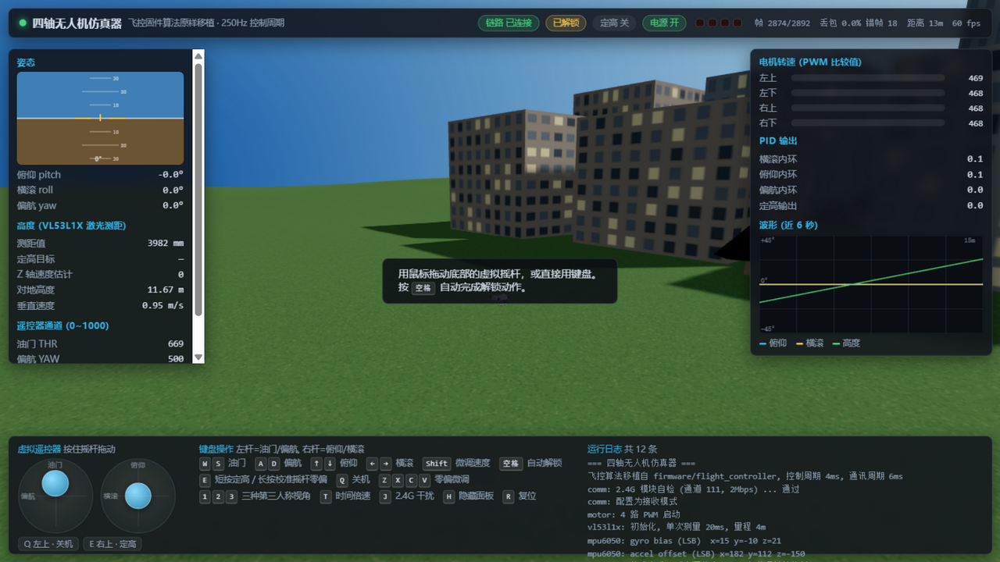
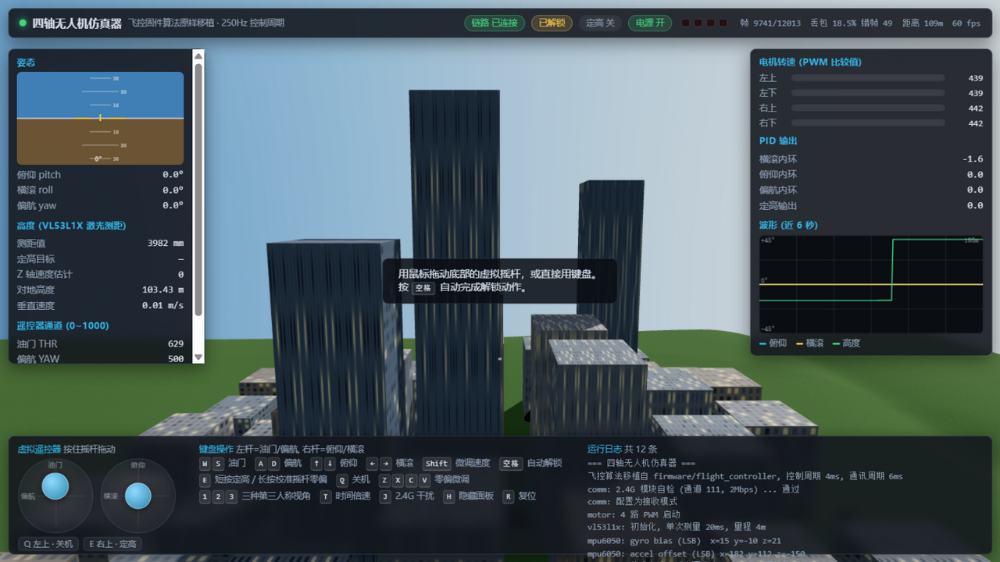
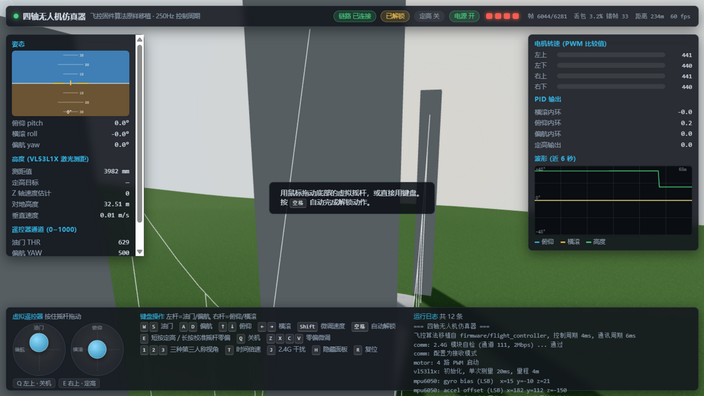
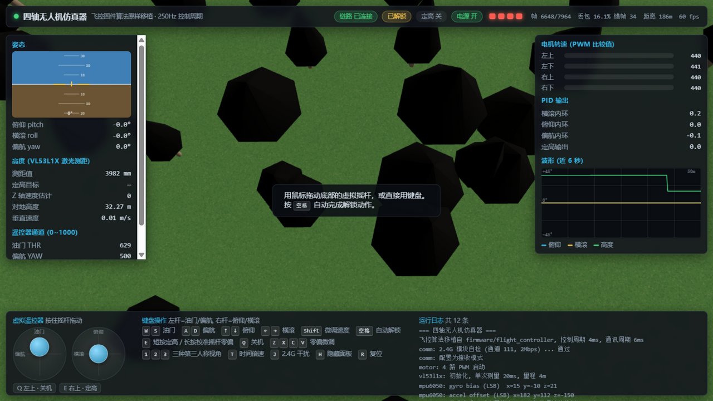

# 四轴无人机 · 飞控 + 遥控器

基于 **STM32F103C8T6 + FreeRTOS** 的微型四轴无人机完整方案，包含**飞控板固件**与**遥控器固件**两部分，通过 2.4G 无线链路通信。

飞控板完成姿态解算、串级 PID 姿态控制与激光定高；遥控器完成双摇杆采样、按键交互、OLED 状态显示与数据下行。两块板子使用同一套分层软件架构和同一套通信协议。

---

## 目录

- [在线仿真](#在线仿真)
- [主要特性](#主要特性)
- [硬件平台](#硬件平台)
- [软件架构](#软件架构)
- [控制算法](#控制算法)
- [通信协议](#通信协议)
- [仓库结构](#仓库结构)
- [编译与烧录](#编译与烧录)
- [操作说明](#操作说明)
- [参数整定](#参数整定)
- [已知限制](#已知限制)
- [第三方组件与许可](#第三方组件与许可)

---

## 在线仿真

仓库里带了一个 **3D 仿真器**（`simulator/`）：把飞控固件里的算法原样移植成 JavaScript，用键盘当遥控器，在带**高楼、大桥、树林**的场景里飞。

控制部分是**同一份逻辑**——姿态解算、串级 PID、定高状态机、解锁状态机、2.4G 帧协议、4ms 控制周期，全都对着固件源码逐行移植。所以仿真里看到的回正快慢、振荡、定高下沉，都是固件那组参数的真实表现，而不是另写了一套"仿真用"的控制律。

```bash
# 在仓库根目录起一个静态服务器
python -m http.server 8000
# 浏览器打开 http://127.0.0.1:8000/simulator/
```

也可以开启 GitHub Pages 后访问 `https://<用户名>.github.io/Quadcopter_drone/simulator/`。

| 按键 | 作用 |
| --- | --- |
| <kbd>W</kbd> <kbd>S</kbd> | 油门（松手保持） |
| <kbd>A</kbd> <kbd>D</kbd> | 偏航 |
| <kbd>↑</kbd> <kbd>↓</kbd> <kbd>←</kbd> <kbd>→</kbd> | 俯仰 / 横滚 |
| <kbd>空格</kbd> | 自动解锁 |
| <kbd>E</kbd> | 短按定高 / 长按校准摇杆零偏 |
| <kbd>Q</kbd> | 关机 |
| <kbd>1</kbd><kbd>2</kbd><kbd>3</kbd> | 三种第三人称视角：追尾跟随 / 环绕 / 俯视跟随 |
| <kbd>T</kbd> | 时间倍速（慢动作看控制环路） |
| <kbd>J</kbd> | 注入 2.4G 干扰，观察断链保护 |
| <kbd>R</kbd> | 复位 |

**底栏左边就是虚拟遥控器**：两个圆形摇杆，鼠标按住拖动即可操纵。左杆是油门（松手保持）与偏航（松手回中），右杆是俯仰与横滚（松手自动回中）——和真摇杆的弹簧手感一致。键盘和鼠标是同一个通道值的两个入口，互相同步。

界面上能看到姿态地平仪、激光测距、4 路电机 PWM、4 个 PID 输出与姿态/高度波形；4 个 LED 直接反映固件灯控任务算出的引脚电平。





<table>
<tr>
<td width="50%"></td>
<td width="50%"></td>
</tr>
</table>

机身外观参考大疆消费级四轴的设计语言（白色圆润外壳、深色机臂、机头下方云台相机、起落架），**全部用基本几何体程序化生成，没有使用任何大疆的模型或贴图资源**。

仿真器自带**命令行自检**（37 项，浏览器与自检共用同一份源文件）：

```bash
node simulator/tools/selftest.mjs
```

覆盖快平方根倒数精度、2.4G 三级校验（含单比特翻转）、AHRS 收敛、三轴环路负反馈、解锁状态机、断链保护、定高环、未解锁严禁转电机等。物理参数由 `tools/tune.mjs` 数值整定，保证固件那组增益在模型上收敛（三轴受扰 0.1s 收敛、残余角速度 ~0.002 rad/s）。

操作说明见 [simulator/README.md](simulator/README.md)，技术细节见 [docs/05-仿真器.md](docs/05-仿真器.md)。

---

## 主要特性

**飞控板**

- 四元数姿态解算 + 加速度计 PI 补偿，抑制陀螺仪积分漂移
- 三轴**串级 PID**（角度外环 + 角速度内环），250 Hz 控制周期
- VL53L1X 激光测距定高，高度外环 + Z 轴速度内环，互补滤波估计垂直速度
- 6 轴数据分级滤波：角速度一阶低通、加速度逐轴卡尔曼
- 基于 FreeRTOS 的多任务调度，任务间用通知/临界区同步
- 断链保护：连续 1.2 s 收不到遥控器数据即自动上锁并退出定高

**遥控器**

- 4 通道摇杆 ADC + DMA 连续采集，12 位分辨率映射为 0~1000 行程量
- 摇杆零偏支持在线自校准（长按右上键采集 100 次取平均）+ 4 个微调按键实时修正
- 6 个按键扫描，右上键支持长按（触发摇杆零偏自校准）
- 128×64 OLED 实时显示射频信道与 4 个通道的行程量
- 与飞控板完全对称的电源管理（IP5305T 按键脉冲开关机）

**通信**

- Si24R1（NRF24L01 兼容）2.4G 链路，2 Mbps，通道 111
- 自定义 18 字节定长帧，含帧头、长度、累加校验和三级校验
- 双向均带 CRC 与长度校验，错帧直接丢弃

---

## 硬件平台

### 飞控板

| 项目 | 型号 / 配置 | 接口 |
| --- | --- | --- |
| MCU | STM32F103C8T6（Cortex-M3，72 MHz，64 KB Flash / 20 KB RAM） | — |
| 姿态传感器 | MPU6050（陀螺仪 ±2000 °/s，加速度 ±2 g，500 Hz 输出） | I2C1，400 kHz |
| 激光测距 | VL53L1X（长距离模式，单次测量 20 ms） | I2C2，400 kHz |
| 无线模块 | Si24R1 / NRF24L01（2 Mbps，7 dBm，通道 111） | SPI1，软件片选 |
| 电机 | 4 × 空心杯电机，PWM 18 kHz | TIM1_CH3 / TIM2_CH2 / TIM3_CH1 / TIM4_CH4 |
| 电源管理 | IP5305T（按键脉冲开关机） | GPIO |
| 状态指示 | 4 × LED，分别对应机臂的左上/左下/右上/右下 | GPIO |
| 调试串口 | USART2，115200 | — |

### 遥控器

| 项目 | 型号 / 配置 | 接口 |
| --- | --- | --- |
| MCU | STM32F103C8T6 | — |
| 摇杆 | 2 × 双轴摇杆，4 路 12 位 ADC | ADC1 + DMA（PA1/PA2/PA3/PA6） |
| 按键 | 6 个（左、右、上、下、左上、右上） | GPIO |
| 显示 | OLED 128×64（SSD1306） | 软件 SPI |
| 无线模块 | Si24R1 / NRF24L01 | SPI1（重映射到 PB3/PB4/PB5） |
| 电源管理 | IP5305T | GPIO |
| 调试串口 | USART1 | — |

> 机架为 **X 字型**：机头夹在两个电机之间。4 个电机两两反向旋转，抵消陀螺效应与空气动力扭矩。

---

## 软件架构

两块板子都采用分层结构，上层不直接接触寄存器与外设句柄：

```
        ┌──────────────────────────────────────────────┐
应用层   │ App_Task      任务创建与调度骨架              │
App/    │ App_Flight    姿态解算 / PID / 电机分配        │
        │ App_Communication  收发与链路状态机            │
        │ App_DataProcess / App_Display     (遥控器)    │
        ├──────────────────────────────────────────────┤
公共层   │ Com_Config    全局类型、协议常量、全局状态      │
Common/ │ Com_IMU       四元数姿态解算                  │
        │ Com_PID       单环 / 串级 PID                 │
        │ Com_Filter    一阶低通 + 一维卡尔曼            │
        │ Com_Debug     日志与串口重定向                 │
        ├──────────────────────────────────────────────┤
硬件接口层│ Inf_Motor / Inf_MPU6050 / Inf_VL53LX1        │
Inf/    │ Inf_Si24R1 / Inf_LED / Inf_IP5305T            │
        │ Inf_JoyStickAndKey / OLED        (遥控器)     │
        ├──────────────────────────────────────────────┤
驱动/中间件│ STM32 HAL 库 + FreeRTOS (CMSIS-RTOS 风格)    │
Core/ Mid/
```

### 飞控板任务划分

| 任务 | 优先级 | 周期 | 栈(字) | 职责 |
| --- | --- | --- | --- | --- |
| `start_task` | 10 | 一次性 | 128 | 创建其余任务后自删除 |
| `power_task` | 9 | 事件 / 10 s | 128 | 响应关机命令；周期性补开机脉冲 |
| `flight_task` | 8 | 4 ms | 256 | 滤波 → 姿态解算 → PID → 电机输出 |
| `comm_task` | 8 | 6 ms | 256 | 收帧、校验、连接判定、解锁状态机 |
| `led_task` | 2 | 50 ms | 128 | 按飞行状态刷新 4 个 LED |

### 遥控器任务划分

| 任务 | 优先级 | 周期 | 栈(字) | 职责 |
| --- | --- | --- | --- | --- |
| `start_task` | 10 | 一次性 | 128 | 创建其余任务后自删除 |
| `power_task` | 9 | 事件 / 10 s | 128 | 关机响应与防自动关机 |
| `comm_task` | 8 | 6 ms | 256 | 组帧并发送摇杆数据 |
| `key_task` | 7 | 50 ms | 256 | 按键扫描与长按识别 |
| `joystick_task` | 7 | 4 ms | 256 | 摇杆采样、极性换算、零偏扣除 |
| `display_task` | 7 | 6 ms | 256 | OLED 刷新 |

FreeRTOS 配置：抢占式调度，1 kHz 时基，最大优先级 32，堆 12 KB（heap_4）。

### 关键设计取舍

- **控制周期 4 ms**：MPU6050 输出率 500 Hz，控制周期取 2 倍采样间隔，兼顾相位滞后与 CPU 占用。
- **临界区只保护"数据快照"**：所有可能阻塞的调用（延时、等待）都放在临界区之外。临界区里调用 `vTaskDelay()` 会关中断导致时基停摆，任务永久卡死。
- **滤波分级**：角速度用一阶低通（保相位），加速度用卡尔曼（抗振动），避免用同一种滤波牺牲其中一项。
- **浮点用单精度**：Cortex-M3 无硬件浮点单元，双精度要再模拟一层，运算量明显更大。

---

## 控制算法

### 姿态解算

以四元数描述机体姿态，用一阶龙格库塔法递推，并用加速度计测得的重力方向对陀螺仪做 PI 补偿：

1. 由四元数提取等效旋转矩阵中的重力方向
2. 加速度归一化后与估计重力方向做叉乘，得到姿态误差
3. 误差经比例项与积分项补偿到角速度上（Kp = 0.8，Ki = 0.0003），积分项负责消除陀螺仪常值零漂
4. 更新并归一化四元数
5. 由旋转矩阵元素反解俯仰角、横滚角；偏航角直接对 Z 轴角速度积分（低于 0.5 °/s 视为零漂不积分）
6. 归一化用"魔数初值 + 两次牛顿迭代"的快速平方根倒数，避免调用软件 `sqrtf`

俯仰角解算对 `asin` 的入参做了 ±1 限幅：归一化的数值误差会让入参略微越界，`asin` 返回 NaN 后会污染整条控制链。

### 串级 PID

姿态为 **3 组串级 PID**：外环控角度、内环控角速度。外环输出作为内环期望值。

| 轴 | 外环 (角度) | 内环 (角速度) |
| --- | --- | --- |
| 俯仰 | Kp = -7.0 | Kp = 2.0, Kd = 0.1 |
| 横滚 | Kp = -7.0 | Kp = -2.0, Kd = -0.1 |
| 偏航 | Kp = -2.2 | Kp = -1.5 |

偏航外环的误差按**最短角度路径**（-180°~180°）折算，避免期望 0° / 实测 359° 被当成大误差而反向猛转一圈。

内环把角速度放在里面是有原因的：角度由角速度和加速度解算而来，加速度易受振动干扰，因此角度环的噪声更大；角速度响应更快、更干净，放在内环能显著提升抗干扰能力。

### 定高

高度环每 5 个控制周期运行一次（20 ms），同样是串级结构：

- **外环**：高度（VL53L1X 测距，Kp = -1.4）
- **内环**：Z 轴速度（Kp = -1.3, Kd = -0.08）

Z 轴速度用**互补滤波**估计：加速度积分响应快但有累积漂移，高度差分不漂但滞后，两者按 0.9 / 0.1 加权。

测距做了野值剔除：单次跳变超过 500 mm，或正在水平打杆（激光斜射地面）时，沿用上一次结果。

进入定高时记录当前油门与高度，此后油门变化超过阈值即退出定高，回到手动模式。

---

## 通信协议

**一帧 18 字节，定长：**

| 偏移 | 长度 | 含义 |
| --- | --- | --- |
| 0 ~ 2 | 3 | 帧头 `0x11 0x22 0x33` |
| 3 | 1 | 载荷长度 = 10 |
| 4 ~ 5 | 2 | 油门 THR（大端，0 ~ 1000） |
| 6 ~ 7 | 2 | 偏航 YAW |
| 8 ~ 9 | 2 | 俯仰 PIT |
| 10 ~ 11 | 2 | 横滚 ROL |
| 12 | 1 | 关机命令（单次触发，发送后清零） |
| 13 | 1 | 定高切换（单次触发，接收方收到 1 即取反） |
| 14 ~ 17 | 4 | 累加校验和（大端，覆盖第 0 ~ 13 字节） |

**接收端三级校验**：帧头 → 载荷长度 → 累加校验和，全部通过才认为数据有效。2.4G 在受干扰或丢包时可能收到错帧，只校验帧头不足以挡住脏数据。

**链路状态机：**

- 收到任意一帧即判为"已连接"；连续 1.2 s（200 帧）无数据判为"失联"
- 失联时飞控自动上锁并退出定高

**解锁流程**（防止误触）：

```
自由状态 ──油门 ≥ 960──▶ 最大值附近 ──保持 1.2 s──▶ 离开最大值
                                                      │
                                                  油门 ≤ 20
                                                      ▼
已解锁 ◀──保持 1.2 s── 最小值附近 ◀────────────────────┘
```

解锁后若油门持续停留在最低位 60 s，自动上锁。

---

## 仓库结构

```
Quadcopter_drone/
├── firmware/
│   ├── flight_controller/          飞控板固件
│   │   ├── App/                    应用层: 任务、飞行控制、通信
│   │   ├── Common/                 公共层: 配置、姿态解算、PID、滤波、调试
│   │   ├── Inf/                    硬件接口层: 电机、MPU6050、VL53L1X、Si24R1、LED、电源
│   │   ├── Core/                   CubeMX 生成的外设初始化与中断
│   │   ├── Drivers/                STM32 HAL 与 CMSIS
│   │   ├── Mid/FreeRTOS/           FreeRTOS 内核与配置
│   │   ├── FlightController.ioc    CubeMX 工程(可重新生成外设配置)
│   │   └── MDK-ARM/                Keil MDK 工程
│   └── remote_controller/          遥控器固件(结构同上)
├── simulator/                      3D 仿真器(飞控算法的 JS 移植 + 键盘遥控)
│   ├── index.html                  入口页面
│   ├── js/fw/                      固件算法移植, 与 C 文件一一对应
│   ├── js/sim/                     六自由度动力学与虚拟传感器
│   ├── js/world/                   场景布局与 Three.js 渲染
│   ├── js/ui/                      键盘输入、虚拟摇杆、仪表盘
│   └── tools/                      命令行自检与物理参数整定
├── docs/
│   ├── 四轴无人机_飞控板设计说明.docx   详细设计文档(含原理图与截图)
│   ├── 四轴无人机_遥控器设计说明.docx
│   ├── 01-系统架构.md
│   ├── 02-通信协议.md
│   ├── 03-姿态解算与串级PID.md
│   ├── 04-开发环境与编译.md
│   └── 05-仿真器.md
├── LICENSE
└── README.md
```

---

## 编译与烧录

### 环境要求

- **Keil MDK-ARM 5**（ARM Compiler 5，即 AC5）
- STM32F1xx Device Family Pack
- ST-Link / J-Link 调试器

### 步骤

1. 用 Keil 打开工程：
   - 飞控板：`firmware/flight_controller/MDK-ARM/FlightController.uvprojx`
   - 遥控器：`firmware/remote_controller/MDK-ARM/RemoteController.uvprojx`
2. 确认 Target 选项里已勾选 **Use MicroLIB**（`printf` 重定向到串口需要它）
3. 编译（F7），然后下载（F8）

### 命令行编译

```bash
UV4.exe -b firmware/flight_controller/MDK-ARM/FlightController.uvprojx -j0 -o build.log
UV4.exe -b firmware/remote_controller/MDK-ARM/RemoteController.uvprojx -j0 -o build.log
```

### 源码编码说明

源码中的注释为中文，文件编码统一为 **UTF-8 无 BOM**。

**不要给源文件加 UTF-8 BOM**：ARM Compiler 5 不识别 BOM，会直接报 `error: #7: unrecognized token`。

另一个容易踩的坑是**字符串字面量里不要出现中文**。ARMCC 5 按系统 ANSI 代码页解析源文件，UTF-8 的中文串会被错误解码，尾字节有可能"吃掉"收尾的引号，报出 `improperly terminated macro invocation` 这类看不懂的错误。因此工程里所有 `debug_printfln()` 的内容都是 ASCII，中文只出现在注释里。

在 Keil 编辑器中查看中文注释，请把 `Edit → Configuration → Editor → Encoding` 设为 **UTF-8**。

---

## 操作说明

**开机**：接通电池，IP5305T 由按键脉冲开机，飞控开始陀螺仪静止校准（约 0.5 s，需保持机身静止），随后 4 个 LED 依连接状态闪烁。

**LED 状态含义**（灯控任务周期 50 ms，表中的数字是电平翻转周期，即完整闪烁周期的两倍）：

| 状态 | 左上 / 右上 | 左下 / 右下 |
| --- | --- | --- |
| 未连接 | 慢闪（翻转 750 ms） | 常灭 |
| 已连接未解锁 | 常灭 | 慢闪（翻转 750 ms） |
| 已解锁（首次） | 常灭 | 常灭 |
| 已解锁（之后） | 中速闪（翻转 500 ms） | 中速闪（翻转 500 ms） |
| 定高模式 | 快闪（翻转 100 ms） | 快闪（翻转 100 ms） |

**解锁**：油门推到最高并保持 1.2 s，再拉到最低并保持 1.2 s。解锁后油门超过 30 电机才会转动。

**定高**：按遥控器右上键切换。进入定高后油门变化超过阈值会自动退出。

**摇杆校准**：长按遥控器右上键，保持摇杆居中约 1 s，完成零偏自校准。上下左右四个方向键可在飞行中微调零偏。

**关机**：按遥控器左上键，飞控收到关机命令后模拟两次按键脉冲关闭 IP5305T。

---

## 参数整定

PID 参数都在 `firmware/flight_controller/App/flight/App_Flight.c` 顶部的结构体初始化里。

姿态环建议按 **内环 → 外环** 的顺序调：

1. **内环 P**：先确定极性。加速下跌说明极性错了；缓慢平滑下跌才对。再调大小，让扰动后的回正过程平滑不抖。
2. **外环 P**：确定极性，正确时飞机会回到初始姿态而不是持续旋转。再调大小，观察回正速度，允许少量震荡。
3. **内环 D**：抑制震荡。极性错了震荡会加剧，对了会减弱。
4. **外环 D**：内环 D 压不住震荡时再加。
5. **I**：一般不需要；若要消除静态误差再加，并同时设置积分限幅（`PID_Struct` 的 `integralMin/integralMax`）。

高度环同理，先调 Z 轴速度内环，再调高度外环。

---

## 已知限制

- **定高的量纲不统一**：Z 轴速度的互补滤波里，加速度项是加速度计的原始 LSB，位置项是 mm/s，两者量纲不一致，靠权重"凑"出可用效果。若要进一步提升定高精度，应把加速度换算成物理单位再融合，并重新整定高度环参数（改动会牵连增益，需要重新试飞）。
- **偏航角长期漂移**：偏航只靠陀螺仪积分，没有磁力计做绝对参考，长时间飞行会有缓慢漂移。
- **无位置控制**：没有光流/视觉，水平方向完全靠手动，不能定点悬停。
- **激光测距受地面材质影响**：深色或强反光地面会偶发跳变，代码里做了野值剔除但仍可能瞬时失效。
- **姿态解算与加速度计零偏耦合**：加速度计零偏在开机时一次性标定，之后不再更新，温漂会带来缓慢的姿态误差。

后续可以做的方向：加入磁力计做九轴融合、把垂直速度的量纲统一、增加上位机参数在线整定。

---

## 第三方组件与许可

工程内包含以下第三方组件，其版权与许可声明保留在各自的源文件中：

| 组件 | 位置 | 许可 |
| --- | --- | --- |
| FreeRTOS Kernel V202212.01 | `Mid/FreeRTOS/` | MIT |
| STM32F1xx HAL Driver / CMSIS | `Drivers/` | BSD-3-Clause（ST / ARM） |
| ST VL53L1X 官方驱动 | `Inf/vl53lx1/VL53L1X_*.c/h`、`vl53l1_*.c/h` | ST 官方许可（见文件头部声明） |

本仓库中除上述第三方组件外的全部代码与文档采用 **MIT 许可**，详见 [LICENSE](LICENSE)。

---

## 作者

**林耿超 (Felix)** — 设计、开发与调试
